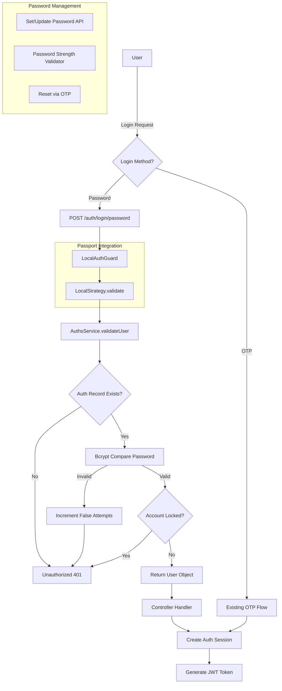

# Add Username/Password Authentication to Existing OTP System

## System Analysis

**Current Architecture:**

- NestJS monorepo with NX
- PostgreSQL + Prisma ORM
- **PassportJS with JWT strategy** (`@nestjs/passport`, `passport-jwt`)
- JwtStrategy + JwtGuard already implemented
- Event-driven architecture (EventEmitter2)
- Flexible Auth model with service/serviceId pattern
- Existing crypto utilities (AES-256-GCM)

**Current Auth Flow:**

- OTP: `/auth/otp` → `/auth/login` (with challenge + OTP)
- Wallet: `/auth/challenge` → `/auth/wallet` (with challenge + signature)

## Architecture Overview



## Database Schema Changes

### 1. Add Password Field to Auth Table

**Migration: `add_password_to_auth`**

Add `passwordHash` field to store bcrypt hashed passwords in the `Auth` table:

```prisma
model Auth {
  id            Int       @id @default(autoincrement())
  userId        Int
  service       Service
  serviceId     String
  passwordHash  String?   // NEW FIELD
  details       Json?     @db.JsonB()
  challenge     String?
  falseAttempts Int       @default(0)
  isLocked      Boolean   @default(false)
  lockedOnAt    DateTime?
  lastLoginAt   DateTime?
  // ... rest of fields
}
```

**Rationale:**

- Reuses existing `Auth` table structure
- `passwordHash` is nullable for backward compatibility
- Keeps password tied to specific service (EMAIL or PHONE)
- Leverages existing `isLocked` and `falseAttempts` for security

### 2. Update Service Enum (Already has API - perfect for password auth)

The existing `Service.API` enum value can be repurposed or we keep password tied to EMAIL/PHONE service records.

## Implementation Plan

### Phase 1: Core Infrastructure

#### 1.1 Add Password Hashing Utility

**File: [`libs/user/src/lib/utils/password.utils.ts`](libs/user/src/lib/utils/password.utils.ts)** (NEW)

- Use `bcrypt` (industry standard, already NestJS compatible)
- Functions: `hashPassword()`, `verifyPassword()`, `validatePasswordStrength()`
- Password requirements: min 8 chars, 1 uppercase, 1 lowercase, 1 number, 1 special char

#### 1.2 Create Password DTOs

**File: [`libs/extensions/src/dtos/authDto/password-login.dto.ts`](libs/extensions/src/dtos/authDto/password-login.dto.ts)** (NEW)

```typescript
export class PasswordLoginDto {
  @IsString()
  @IsNotEmpty()
  identifier: string; // email or phone

  @IsString()
  @IsNotEmpty()
  password: string;

  @IsEnum(Service)
  service?: Service; // EMAIL or PHONE
}
```

**File: [`libs/extensions/src/dtos/authDto/set-password.dto.ts`](libs/extensions/src/dtos/authDto/set-password.dto.ts)** (NEW)

```typescript
export class SetPasswordDto {
  @IsString()
  @IsNotEmpty()
  @MinLength(8)
  password: string;

  @IsString()
  @IsNotEmpty()
  confirmPassword: string;

  @IsEnum(Service)
  service: Service; // EMAIL or PHONE
}
```

**File: [`libs/extensions/src/dtos/authDto/reset-password.dto.ts`](libs/extensions/src/dtos/authDto/reset-password.dto.ts)** (NEW)

```typescript
export class ResetPasswordDto {
  @IsString()
  @IsNotEmpty()
  challenge: string; // OTP challenge from existing flow

  @IsString()
  @IsNotEmpty()
  otp: string;

  @IsString()
  @IsNotEmpty()
  @MinLength(8)
  newPassword: string;

  @IsEnum(Service)
  service: Service;
}
```

### Phase 2: Passport Strategy Implementation

#### 2.1 Create LocalStrategy (Passport Pattern)

**File: [`libs/user/src/lib/auths/strategy/local.strategy.ts`](libs/user/src/lib/auths/strategy/local.strategy.ts)** (NEW)

Following the same pattern as `JwtStrategy`:

```typescript
import { Injectable, UnauthorizedException } from '@nestjs/common';
import { PassportStrategy } from '@nestjs/passport';
import { Strategy } from 'passport-local';
import { AuthsService } from '../auths.service';

@Injectable()
export class LocalStrategy extends PassportStrategy(Strategy, 'local') {
  constructor(private authsService: AuthsService) {
    super({
      usernameField: 'identifier', // email or phone
      passwordField: 'password',
      passReqToCallback: true, // Pass request to validate method
    });
  }

  async validate(req: any, identifier: string, password: string): Promise<any> {
    // Extract service from request body or detect from identifier
    const service = req.body?.service;
    const user = await this.authsService.validateUser(identifier, password, service);
    if (!user) {
      throw new UnauthorizedException('Invalid credentials');
    }
    return user; // Attached to request.user
  }
}
```

#### 2.2 Create LocalAuthGuard

**File: [`libs/user/src/lib/auths/guard/local.guard.ts`](libs/user/src/lib/auths/guard/local.guard.ts)** (NEW)

```typescript
import { Injectable } from '@nestjs/common';
import { AuthGuard } from '@nestjs/passport';

@Injectable()
export class LocalAuthGuard extends AuthGuard('local') {}
```

#### 2.3 Update Guards Index

**File: [`libs/user/src/lib/auths/guard/index.ts`](libs/user/src/lib/auths/guard/index.ts)**

```typescript
export * from './jwt.guard';
export * from './local.guard'; // ADD THIS
```

#### 2.4 Update Strategy Index

**File: [`libs/user/src/lib/auths/strategy/index.ts`](libs/user/src/lib/auths/strategy/index.ts)**

```typescript
export * from './jwt.strategy';
export * from './local.strategy'; // ADD THIS
```

### Phase 3: Service Layer Updates

#### 3.1 Extend AuthsService

**File: [`libs/user/src/lib/auths/auths.service.ts`](libs/user/src/lib/auths/auths.service.ts)**

Add new methods:

1. **`validateUser(identifier: string, password: string, service?: Service)`**

   - This is called by LocalStrategy during login
   - Determine service type from identifier if not provided (email vs phone)
   - Find Auth record by service + serviceId
   - Check if passwordHash exists (throw if null)
   - Check `isLocked` status (throw if locked)
   - Verify password using bcrypt.compare()
   - If invalid: increment `falseAttempts`, lock after threshold
   - If valid: reset `falseAttempts` to 0
   - Return user object with auth info (for controller to create session)

2. **`setPassword(userId: number, dto: SetPasswordDto)`**

   - Validate password strength
   - Check password === confirmPassword
   - Hash password with bcrypt
   - Update Auth.passwordHash for specified service
   - Emit event: `PASSWORD_SET`

3. **`updatePassword(userId: number, oldPassword: string, newPassword: string, service: Service)`**

   - Verify old password
   - Validate new password strength
   - Hash and update passwordHash

4. **`resetPasswordWithOtp(dto: ResetPasswordDto, requestInfo: Request)`**

   - Reuse existing OTP validation logic
   - Verify challenge + OTP (similar to `loginByOtp`)
   - Hash and set new password
   - Clear challenge field
   - Emit event: `PASSWORD_RESET`

5. **`hasPassword(userId: number, service: Service)`**

   - Check if Auth.passwordHash is not null for given service
   - Used for UI to show/hide password login option

#### 2.2 Update UsersService

**File: [`libs/user/src/lib/users/users.service.ts`](libs/user/src/lib/users/users.service.ts)**

Add method to support setting password during user creation (optional):

```typescript
async createWithPassword(dto: CreateUserDto & { password?: string })
```

### Phase 4: Controller Layer

#### 4.1 Extend AuthsController

**File: [`libs/user/src/lib/auths/auths.controller.ts`](libs/user/src/lib/auths/auths.controller.ts)**

Add new endpoints with Passport guards:

```typescript
// Password login using LocalAuthGuard (Passport handles validation)
@UseGuards(LocalAuthGuard)
@Post('login/password')
async loginPassword(@Request() req, @RequestDetails() rdetails: Request) {
  // req.user is populated by LocalStrategy after successful validation
  return this.authService.createAuthSessionAndToken(req.user, rdetails);
}

@UseGuards(JwtGuard)
@Post('password/set')
setPassword(@CurrentUser() user: CurrentUser, @Body() dto: SetPasswordDto) {
  return this.authService.setPassword(user.id, dto);
}

@UseGuards(JwtGuard)
@Post('password/change')
changePassword(@CurrentUser() user: CurrentUser, @Body() dto: ChangePasswordDto) {
  return this.authService.updatePassword(
    user.id,
    dto.oldPassword,
    dto.newPassword,
    dto.service
  );
}

@Post('password/reset')
resetPassword(@Body() dto: ResetPasswordDto, @RequestDetails() rdetails: Request) {
  return this.authService.resetPasswordWithOtp(dto, rdetails);
}

@UseGuards(JwtGuard)
@Get('password/status')
checkPasswordStatus(@CurrentUser() user: CurrentUser, @Query('service') service: Service) {
  return this.authService.hasPassword(user.id, service);
}
```

**Key Pattern:** The `@UseGuards(LocalAuthGuard)` decorator triggers Passport's LocalStrategy, which validates credentials before the controller method runs. This matches your existing JWT guard pattern.

#### 4.2 Update AuthsModule

**File: [`libs/user/src/lib/auths/auths.module.ts`](libs/user/src/lib/auths/auths.module.ts)**

Register LocalStrategy as a provider:

```typescript
@Module({
  imports: [JwtModule.register({}), PrismaModule, PassportModule, ConfigModule],
  controllers: [AuthsController],
  providers: [
    AuthsService,
    JwtStrategy,
    LocalStrategy, // ADD THIS
  ],
  exports: [AuthsService],
})
export class AuthsModule {}
```

### Phase 5: Security Enhancements

#### 4.1 Account Lockout Logic

Enhance existing `Auth.isLocked` mechanism:

- Lock account after 5 consecutive failed password attempts
- Lock duration: 15 minutes (or configurable)
- Reset `falseAttempts` to 0 on successful login
- Admin unlock endpoint (optional)

#### 5.2 Password Validation

**File: [`libs/user/src/lib/utils/password.utils.ts`](libs/user/src/lib/utils/password.utils.ts)**

```typescript
export const PASSWORD_REGEX = /^(?=.*[a-z])(?=.*[A-Z])(?=.*\d)(?=.*[@$!%*?&])[A-Za-z\d@$!%*?&]{8,}$/;

export function validatePasswordStrength(password: string): {
  isValid: boolean;
  errors: string[];
};
```

### Phase 6: Events and Integration

#### 6.1 Add New Events

**File: [`libs/user/src/lib/constants/events.ts`](libs/user/src/lib/constants/events.ts)**

```typescript
export const EVENTS = {
  // ... existing events
  PASSWORD_SET: 'password.set',
  PASSWORD_CHANGED: 'password.changed',
  PASSWORD_RESET: 'password.reset',
  PASSWORD_LOGIN_FAILED: 'password.login.failed',
  ACCOUNT_LOCKED: 'account.locked',
};
```

#### 6.2 Error Constants

**File: [`libs/user/src/lib/constants/errors.ts`](libs/user/src/lib/constants/errors.ts)**

```typescript
export const ERRORS = {
  // ... existing errors
  INVALID_PASSWORD: RSE('Invalid password', 'INVALID_PASSWORD', 401),
  PASSWORD_TOO_WEAK: RSE('Password does not meet strength requirements', 'PASSWORD_TOO_WEAK', 400),
  PASSWORD_MISMATCH: RSE('Passwords do not match', 'PASSWORD_MISMATCH', 400),
  ACCOUNT_LOCKED: RSE('Account is locked due to multiple failed attempts', 'ACCOUNT_LOCKED', 423),
  PASSWORD_NOT_SET: RSE('Password not set for this account', 'PASSWORD_NOT_SET', 400),
};
```

### Phase 7: Testing Strategy

#### 7.1 Unit Tests

Create test files:

- [`libs/user/src/lib/auths/auths.service.password.spec.ts`](libs/user/src/lib/auths/auths.service.password.spec.ts)
- [`libs/user/src/lib/utils/password.utils.spec.ts`](libs/user/src/lib/utils/password.utils.spec.ts)

Test scenarios:

- Password hashing and verification
- Password strength validation
- Login with valid/invalid passwords
- Account lockout after failed attempts
- Password reset flow

#### 7.2 Integration Tests

**File: [`apps/sample-e2e/src/auth/password-auth.spec.ts`](apps/sample-e2e/src/auth/password-auth.spec.ts)** (NEW)

- Full login flow with password
- Set password for existing OTP user
- Reset password via OTP
- Account lockout scenario
- Backward compatibility: OTP login still works

## Migration Guide

### For Existing Users

1. **No Breaking Changes**: Existing OTP auth continues to work
2. **Opt-in Password**: Users can call `POST /auth/password/set` when logged in
3. **Password Reset**: Users can reset password via `POST /auth/otp` + `POST /auth/password/reset`

### Database Migration Script

**File: `prisma/migrations/YYYYMMDDHHMMSS_add_password_to_auth/migration.sql`**

```sql
-- Add passwordHash column to Auth table
ALTER TABLE "tbl_auth" ADD COLUMN "passwordHash" TEXT;

-- Add index for faster lookups
CREATE INDEX "idx_auth_password_not_null" ON "tbl_auth"("userId", "service")
WHERE "passwordHash" IS NOT NULL;
```

## Configuration

**Environment Variables:**

```bash
# Add to .env
PASSWORD_MIN_LENGTH=8
PASSWORD_REQUIRE_UPPERCASE=true
PASSWORD_REQUIRE_LOWERCASE=true
PASSWORD_REQUIRE_DIGIT=true
PASSWORD_REQUIRE_SPECIAL=true
ACCOUNT_LOCKOUT_THRESHOLD=5
ACCOUNT_LOCKOUT_DURATION_MINUTES=15
```

## API Documentation Changes

Update Swagger documentation for new endpoints:

- `POST /auth/login/password` - Login with username/password
- `POST /auth/password/set` - Set password (authenticated)
- `POST /auth/password/change` - Change password (authenticated)
- `POST /auth/password/reset` - Reset password via OTP
- `GET /auth/password/status` - Check if password is set

## Dependencies to Add

```json
{
  "dependencies": {
    "bcrypt": "^5.1.1",
    "passport-local": "^1.0.0"
  },
  "devDependencies": {
    "@types/bcrypt": "^5.0.2",
    "@types/passport-local": "^1.0.38"
  }
}
```

**Note:** `@nestjs/passport` and `passport` are already installed based on existing JWT implementation.

## Timeline Estimate

- **Phase 1 (Infrastructure):** 2-3 hours
- **Phase 2 (Passport Strategy):** 2 hours
- **Phase 3 (Service Layer):** 3-4 hours
- **Phase 4 (Controllers):** 1-2 hours
- **Phase 5 (Security):** 1-2 hours
- **Phase 6 (Events/Integration):** 1 hour
- **Phase 7 (Testing):** 3-4 hours
- **Total:** ~13-18 hours

## Key Benefits

1. **Backward Compatible**: Zero disruption to existing OTP users
2. **Flexible**: Users choose authentication method per login
3. **Secure**: Bcrypt hashing, account lockout, password strength validation
4. **Consistent**: Reuses existing patterns (Auth table, events, JWT flow)
5. **Maintainable**: Follows existing code structure and conventions
6. **Opt-in**: Existing users not forced to migrate
7. **PassportJS Integration**: Leverages existing Passport infrastructure with LocalStrategy, matching your JwtStrategy pattern
8. **Standard Pattern**: Uses `@UseGuards(LocalAuthGuard)` decorator, consistent with `@UseGuards(JwtGuard)`

## Security Considerations

- ✅ Passwords hashed with bcrypt (industry standard)
- ✅ Account lockout after failed attempts (reuses existing mechanism)
- ✅ Password strength validation (configurable)
- ✅ Secure password reset via OTP verification
- ✅ Audit trail via AuthSession table
- ✅ No plaintext passwords stored anywhere
- ✅ Rate limiting (should be added at API gateway/middleware level)

## Frontend Integration Notes

Frontend can detect password availability by:

```typescript
// Check if user has password set for email
GET /auth/password/status?service=EMAIL

// Response: { hasPassword: boolean, service: 'EMAIL' }
```
