# Message Scheduling System - Reliability Analysis & Remediation Plan

## Executive Summary

**CRITICAL FINDING**: The system currently **lacks automated scheduled message execution**. While the infrastructure accepts scheduled messages (`trigger: SCHEDULED`) and stores `scheduledTimestamp`, **no mechanism exists to automatically execute these messages at their scheduled time**.

**Current Risk Level**: 🔴 **HIGH** - Production deployment would result in all scheduled messages remaining undelivered indefinitely unless manually triggered.

## Current System Analysis

### 1. How Scheduled Messages Work Today

```mermaid
sequenceDiagram
    participant Client
    participant API
    participant Database
    participant Queue
    participant Worker

    Client->>API: POST /broadcasts<br/>{trigger: "SCHEDULED",<br/>scheduledTimestamp: "2026-01-15T10:00:00Z"}
    API->>Database: Create Session (triggerType: SCHEDULED)<br/>Create Broadcasts (status: SCHEDULED)
    API->>Client: Return Session ID
    Note over Database: Messages sit in SCHEDULED status<br/>❌ NO AUTOMATED EXECUTION

    rect rgb(255, 200, 200)
    Note over Client,Worker: MANUAL INTERVENTION REQUIRED
    Client->>API: GET /sessions/{id}/trigger
    API->>Database: Query SCHEDULED broadcasts
    API->>Queue: Add to RabbitMQ
    Queue->>Worker: Process broadcasts
    Worker->>Database: Update status to SUCCESS/FAIL
    end
```



### 2. Storage Strategy

**Database Schema** ([`prisma/schema.prisma`](prisma/schema.prisma)):

```
Session:
 - triggerType: TriggerType (IMMEDIATE/SCHEDULED/MANUAL)
 - options: JSON {scheduledTimestamp?: Date, attemptIntervalMinutes?: string}
 - status: SessionStatus (NEW/PENDING/COMPLETED/FAILED)

Broadcast:
 - status: BroadcastStatus (SCHEDULED/PENDING/SUCCESS/FAIL)
 - attempts: Int
 - lastAttempt: DateTime?
```

**Problems:**

- ❌ `scheduledTimestamp` stored in JSON blob - not indexed, no efficient querying
- ❌ No `scheduledAt` first-class column for time-based queries
- ❌ No `executedAt` timestamp to track actual execution time
- ❌ No `lockedBy` or `lockedAt` fields for distributed processing
- ❌ No `idempotencyKey` for duplicate prevention

### 3. Trigger Mechanisms

**Current Implementation:**

**For IMMEDIATE broadcasts** ([`broadcast.service.ts:104-110`](apps/connect/src/broadcast/broadcast.service.ts)):

```typescript
if (newSession.cuid) {
  this.checkTransportReadiness(newSession.cuid, newSession.Transport.type as TransportType);
}
```

✅ Automatic execution initiated immediately

**For SCHEDULED broadcasts:**

- ❌ **NO automatic execution**
- ❌ **NO cron job or scheduler**
- ❌ **NO polling mechanism**
- ⚠️ Manual trigger only: `GET /sessions/:cuid/trigger`

**Available but Unused:**

- `@nestjs/schedule` package installed but **not configured**
- No `@Cron()` decorators
- No interval tasks
- No scheduled workers

### 4. Failure Handling

**Current Retry Logic** ([`broadcast.service.ts:197-248`](apps/connect/src/broadcast/broadcast.service.ts)):

```typescript
async retryBroadcasts(sessionCuid, transportType, retryFailed) {
  // Updates SCHEDULED/PENDING/FAIL → SCHEDULED
  // But only when manually called
}
```

**Problems:**

- ❌ No automatic retry scheduling for failed messages
- ❌ Commented out: `//TODO: Enable for automatic retries` (line 189)
- ❌ No exponential backoff
- ❌ No max retry tracking for scheduled messages
- ❌ No dead letter queue for permanently failed messages

### 5. Idempotency & Duplicate Prevention

**Current State:**

- ❌ No idempotency keys
- ❌ No deduplication logic
- ❌ Same API call can create duplicate broadcasts
- ❌ No protection against double execution if manual trigger called twice
- ❌ Worker processes don't check for in-flight executions

### 6. Edge Cases & Failure Scenarios

| Scenario | Current Behavior | Impact |

| ------------------------------------- | ----------------------------------- | ----------------------------------------- |

| **System downtime** | Scheduled messages remain in DB | 🔴 All schedules missed permanently |

| **Clock skew** | Not applicable (no time checking) | 🟡 Would cause drift if scheduler existed |

| **Concurrent scheduling** | Multiple broadcasts created | 🟡 No deduplication |

| **Message scheduled during downtime** | Stored successfully | 🔴 Never executed |

| **Worker crash mid-batch** | RabbitMQ redelivery works | 🟢 Good |

| **Database connection loss** | API returns error | 🟢 Client can retry |

| **Scheduled time in the past** | Stored as-is | 🔴 Would need immediate execution |

| **Race condition on trigger** | Multiple workers process same batch | 🟡 Possible duplicates |

### 7. Scalability Under Load

**Current Bottlenecks:**

- ❌ No scheduler = no scalability concern (but no functionality!)
- ⚠️ If polling added: Single instance would query ALL scheduled messages
- ⚠️ Batch processing limited to `BATCH_SIZE=20` (env variable)
- ✅ RabbitMQ queue provides good distribution across workers
- ⚠️ PostgreSQL `options` JSON field not optimized for time-based queries

**Projected Performance Issues:**

- Millions of scheduled messages → slow JSON queries
- Single scheduler instance → single point of failure
- No horizontal scaling for scheduler component

### 8. Monitoring & Observability

**Current State:**

- ✅ Basic logging with `Logger` class
- ✅ `BroadcastLog` table tracks execution attempts
- ✅ Status tracking (SUCCESS/FAIL/PENDING)
- ❌ No metrics on scheduled message lag
- ❌ No alerts for missed schedules
- ❌ No visibility into "messages due for execution"
- ❌ No SLA tracking for scheduled delivery accuracy

### 9. Single Points of Failure

```mermaid
flowchart TB
    subgraph Missing[❌ Missing Components]
        Scheduler[Scheduled Message Processor<br/>DOES NOT EXIST]
    end

    subgraph Existing[✅ Existing Infrastructure]
        DB[(PostgreSQL<br/>Single Primary)]
        RabbitMQ[RabbitMQ<br/>Can Cluster]
        Workers[Transport Workers<br/>Can Scale]
    end

    Scheduler -.->|Would query| DB
    Scheduler -.->|Would enqueue| RabbitMQ
    RabbitMQ --> Workers

    style Scheduler fill:#f99
    style DB fill:#ff9
    style RabbitMQ fill:#9f9
    style Workers fill:#9f9
```



**SPOFs:**

1. 🔴 **No scheduler component** - complete system failure for scheduled messages
2. 🟡 **Database** - if primary fails, no way to query pending schedules
3. 🟢 **RabbitMQ** - can be clustered (mitigation exists)
4. 🟢 **Workers** - horizontally scalable (mitigation exists)

---

## Critical Reliability Gaps

### Gap #1: No Automated Scheduling Mechanism ⭐ CRITICAL ⭐

**Problem:** System accepts scheduled messages but never executes them.

**Impact:** 100% of scheduled messages never delivered without manual intervention.

**Evidence:**

- `scheduledTimestamp` stored but never queried
- No cron jobs, schedulers, or polling loops in codebase
- Manual trigger endpoint required: `/sessions/:cuid/trigger`

### Gap #2: Non-Indexed Scheduled Timestamp

**Problem:** `scheduledTimestamp` buried in JSONB `options` field.

**Impact:** Inefficient queries, slow at scale, no database-level optimization.

**Evidence:** Schema line 84 in [`prisma/schema.prisma`](prisma/schema.prisma):

```prisma
options Json? @db.JsonB()
```

### Gap #3: No Distributed Locking

**Problem:** Multiple scheduler instances would process same message.

**Impact:** Duplicate message delivery, wasted resources, customer complaints.

**Evidence:** No locking mechanism in [`broadcast.service.ts`](apps/connect/src/broadcast/broadcast.service.ts).

### Gap #4: No Idempotency Protection

**Problem:** API calls can create duplicate sessions/broadcasts.

**Impact:** Same message sent multiple times to recipients.

**Evidence:** No idempotency key validation in [`broadcast.controller.ts`](apps/connect/src/broadcast/broadcast.controller.ts).

### Gap #5: Commented Out Retry Logic

**Problem:** Automatic retries disabled.

**Impact:** Failed messages require manual intervention.

**Evidence:** Line 189 in [`broadcast.service.ts`](apps/connect/src/broadcast/broadcast.service.ts):

```typescript
//TODO: Enable for automatic retries
```

### Gap #6: No Missed Schedule Recovery

**Problem:** If scheduler is down, past-due messages remain unprocessed.

**Impact:** Messages scheduled during outage never delivered.

**Evidence:** No catchup logic in codebase.

### Gap #7: Insufficient Monitoring

**Problem:** No metrics for schedule drift, missed executions, or queue depth.

**Impact:** Silent failures, no visibility into system health.

**Evidence:** No Prometheus/StatsD/CloudWatch integration.

---

## Production-Ready Remediation Plan

### Phase 1: Foundation - Automated Scheduler (CRITICAL)

**Priority:** 🔴 P0 - Blocker for production

**Objective:** Implement automated execution of scheduled messages.

**Tasks:**

1. **Add Scheduled Timestamp Column**

   - File: [`prisma/schema.prisma`](prisma/schema.prisma)
   - Change: Add `scheduledAt DateTime?` to `Session` model
   - Add index: `@@index([scheduledAt, status])`
   - Migration required

2. **Create Scheduler Service**

   - New file: `apps/connect/src/scheduler/scheduler.service.ts`
   - Use `@nestjs/schedule` with `@Cron()` decorator
   - Poll every minute for due messages
   - Query: `WHERE scheduledAt <= NOW() AND status = 'NEW' AND triggerType = 'SCHEDULED'`

3. **Implement Scheduler Logic**

```typescript
@Injectable()
export class SchedulerService {
  @Cron('*/1 * * * *') // Every minute
  async processDueSchedules() {
    const dueSessions = await this.prisma.session.findMany({
      where: {
        scheduledAt: { lte: new Date() },
        status: SessionStatus.NEW,
        triggerType: TriggerType.SCHEDULED,
      },
      take: 100, // Batch limit
    });

    for (const session of dueSessions) {
      await this.broadcastService.checkTransportReadiness(session.cuid, session.Transport.type);
    }
  }
}
```

4. **Update Broadcast Creation**

   - File: [`apps/connect/src/broadcast/broadcast.service.ts`](apps/connect/src/broadcast/broadcast.service.ts)
   - Extract `scheduledTimestamp` from `options`
   - Set `scheduledAt` column
   - Skip immediate execution if `SCHEDULED`

**Acceptance Criteria:**

- ✅ Scheduled messages execute automatically within 60 seconds of scheduled time
- ✅ No manual intervention required
- ✅ Scheduler runs continuously

**Estimated Effort:** 2-3 days

---

### Phase 2: Idempotency & Locking

**Priority:** 🟡 P1 - High

**Objective:** Prevent duplicate executions and race conditions.

**Tasks:**

1. **Add Idempotency Key Support**

   - Schema change: Add `idempotencyKey String? @unique` to `Session`
   - API change: Accept `Idempotency-Key` header
   - Logic: Return existing session if key matches

2. **Add Distributed Locking**

   - Schema change: Add `lockedAt DateTime?`, `lockedBy String?` to `Session`
   - Logic: Use `UPDATE...WHERE lockedAt IS NULL AND id = ?` pattern
   - Timeout: Release locks older than 5 minutes

3. **Implement SELECT FOR UPDATE**

```typescript
const session = await this.prisma.$queryRaw`
  UPDATE tbl_sessions
  SET "lockedAt" = NOW(), "lockedBy" = ${instanceId}
  WHERE cuid = ${sessionCuid}
  AND "lockedAt" IS NULL
  RETURNING *
`;
if (!session) {
  // Already being processed
  return;
}
```

**Acceptance Criteria:**

- ✅ Same idempotency key returns cached response (409 Conflict)
- ✅ Multiple scheduler instances don't double-process
- ✅ Locks automatically released after timeout

**Estimated Effort:** 3-4 days

---

### Phase 3: Failure Handling & Retries

**Priority:** 🟡 P1 - High

**Objective:** Gracefully handle failures with automatic retry logic.

**Tasks:**

1. **Implement Exponential Backoff**

```typescript
const retryDelays = [5, 15, 60, 300, 900]; // minutes
const nextRetry = new Date(Date.now() + retryDelays[attempt] * 60 * 1000);
```

2. **Add Retry Metadata**

   - Schema: Add `nextRetryAt DateTime?`, `retryCount Int @default(0)`
   - Logic: Update `nextRetryAt` on failure
   - Scheduler: Include `nextRetryAt <= NOW()` in query

3. **Enable Commented Retry Code**

   - File: [`broadcast.service.ts:189`](apps/connect/src/broadcast/broadcast.service.ts)
   - Uncomment automatic retry logic
   - Add max retry limit check

4. **Dead Letter Queue**

   - After max retries: Move to `SessionStatus.FAILED`
   - Create admin endpoint to manually review/retry
   - Log detailed failure reasons

**Acceptance Criteria:**

- ✅ Failed messages automatically retry with backoff
- ✅ Max retries respected (default: 5)
- ✅ Dead letter queue captures permanent failures

**Estimated Effort:** 4-5 days

---

### Phase 4: Catchup & Recovery

**Priority:** 🟡 P1 - High

**Objective:** Handle missed schedules after system downtime.

**Tasks:**

1. **Missed Schedule Detection**

```typescript
@Cron('0 */5 * * * *') // Every 5 minutes
async catchupMissedSchedules() {
  const missedCutoff = new Date(Date.now() - 24 * 60 * 60 * 1000); // 24h ago

  const missed = await this.prisma.session.findMany({
    where: {
      scheduledAt: {
        lt: new Date(),
        gte: missedCutoff,
      },
      status: SessionStatus.NEW,
    },
  });

  // Process with priority
}
```

2. **Grace Period Configuration**

   - Add `MISSED_SCHEDULE_GRACE_PERIOD_HOURS=24` env var
   - After grace period: Mark as `EXPIRED`
   - Send webhook notification if configured

3. **Startup Recovery**

   - On application boot: Run catchup once
   - Ensures immediate recovery after deployment

**Acceptance Criteria:**

- ✅ Messages missed during downtime execute on restart
- ✅ Grace period prevents very old messages from executing
- ✅ Webhooks notify clients of expired schedules

**Estimated Effort:** 2-3 days

---

### Phase 5: Monitoring & Observability

**Priority:** 🟢 P2 - Medium

**Objective:** Comprehensive visibility into scheduler health.

**Tasks:**

1. **Metrics Collection**

   - Integrate `@nestjs/prometheus` or StatsD
   - Metrics:
     - `scheduled_messages_due` (gauge)
     - `scheduled_messages_processed` (counter)
     - `schedule_execution_lag_seconds` (histogram)
     - `scheduler_errors` (counter)
     - `duplicate_detections` (counter)

2. **Health Checks**

   - Endpoint: `GET /health/scheduler`
   - Check: Last successful poll within 2 minutes
   - Check: Queue depth under threshold

3. **Alerting Rules**

   - Alert: Scheduler hasn't run in 5 minutes
   - Alert: >1000 messages overdue
   - Alert: >10% execution lag
   - Alert: Error rate >1%

4. **Dashboards**

   - Grafana/CloudWatch dashboard
   - Panels: Queue depth, lag distribution, success rate
   - SLA tracking: 95th percentile execution lag

**Acceptance Criteria:**

- ✅ Real-time visibility into scheduler performance
- ✅ Alerts fire before customer impact
- ✅ SLA compliance tracked automatically

**Estimated Effort:** 3-4 days

---

### Phase 6: Scalability & Performance

**Priority:** 🟢 P2 - Medium

**Objective:** Handle high message volumes with horizontal scaling.

**Tasks:**

1. **Partitioned Scheduling**

   - Add `partitionKey Int` to `Session` (hash of scheduledAt)
   - Each scheduler instance processes subset of partitions
   - Configuration: `SCHEDULER_PARTITION=0 SCHEDULER_TOTAL_PARTITIONS=5`

2. **Batch Processing Optimization**

   - Increase batch size to 1000
   - Process batches in parallel (10 concurrent)
   - Add circuit breaker for database overload

3. **Database Optimization**

   - Index: `CREATE INDEX idx_session_scheduled ON tbl_sessions(scheduledAt, status) WHERE triggerType = 'SCHEDULED'`
   - Analyze query plans
   - Consider partitioning `tbl_sessions` by month

4. **Read Replica Support**

   - Read due schedules from replica
   - Write lock/status updates to primary
   - Reduces load on primary database

**Acceptance Criteria:**

- ✅ Handle 100K scheduled messages/hour
- ✅ Horizontal scaling validated (3+ scheduler instances)
- ✅ Query performance <50ms at scale

**Estimated Effort:** 5-7 days

---

### Phase 7: Clock Skew & Time Accuracy

**Priority:** 🟢 P3 - Low

**Objective:** Handle clock synchronization issues gracefully.

**Tasks:**

1. **Time Source Standardization**

   - Always use database time: `NOW()` instead of `new Date()`
   - Ensures consistency across distributed services

2. **Skew Detection**

   - Compare app server time vs database time
   - Log warning if drift >1 second
   - Health check fails if drift >10 seconds

3. **Jitter Handling**

   - Add randomized delay (0-10s) to prevent thundering herd
   - Distribute executions across minute boundary

**Acceptance Criteria:**

- ✅ System detects clock skew automatically
- ✅ No thundering herd at minute boundaries
- ✅ Accurate execution regardless of server time drift

**Estimated Effort:** 2-3 days

---

## Implementation Roadmap

### Week 1: Foundation

- ✅ Phase 1: Automated Scheduler (5 days)

### Week 2: Reliability

- ✅ Phase 2: Idempotency & Locking (4 days)
- ✅ Phase 3: Failure Handling (1 day started)

### Week 3: Resilience

- ✅ Phase 3: Failure Handling (4 days completed)
- ✅ Phase 4: Catchup & Recovery (3 days)

### Week 4: Operations

- ✅ Phase 5: Monitoring (4 days)
- ✅ Phase 6: Scalability (1 day started)

### Week 5: Optimization

- ✅ Phase 6: Scalability (4 days completed)
- ✅ Phase 7: Clock Skew (2 days)
- ✅ Testing & Documentation (3 days)

**Total Estimated Effort:** 28-32 days (1.5 months with 1 engineer)

---

## Trade-offs & Design Decisions

### CAP Theorem Considerations

**Current Design: CP (Consistency + Partition Tolerance)**

- Strong consistency via PostgreSQL ACID transactions
- Partitions tolerated via RabbitMQ durability
- Availability sacrificed: Single primary database

**Recommendation: Stay CP**

- Scheduled messages must execute exactly once
- Consistency more important than availability
- Add read replicas for query scaling only

### Alternative Architectures Considered

#### Option 1: Event-Driven with Message Delays

```typescript
// Use RabbitMQ delayed message exchange
channel.publish(exchange, routingKey, message, {
  headers: { 'x-delay': delayMs },
});
```

❌ **Rejected**: Limited to 2^32ms delay (~49 days), hard to cancel/update

#### Option 2: Redis Sorted Sets

```typescript
// Use ZADD with timestamp as score
redis.zadd('scheduled', timestamp, sessionId);
```

✅ **Alternative Consideration**: Fast, simple, but adds Redis dependency

#### Option 3: Dedicated Scheduler Service (e.g., Temporal, Cadence)

✅ **Future Enhancement**: Overkill for current scale, revisit at 1M+ schedules/day

### Recommended Tech Stack

**For Phase 1-4:**

- PostgreSQL (existing)
- `@nestjs/schedule` (already installed)
- RabbitMQ (existing)

**For Phase 5-7:**

- Prometheus + Grafana (monitoring)
- Redis (optional, for distributed locking)

---

## Success Metrics

### Primary KPIs

1. **Schedule Accuracy**: 95% of messages execute within 60s of scheduled time
2. **Reliability**: 99.9% of scheduled messages delivered successfully
3. **Duplicate Rate**: <0.01% of messages sent more than once
4. **Recovery Time**: System catches up within 15 minutes after downtime

### Secondary KPIs

1. **Queue Depth**: <1000 messages pending at any time
2. **Error Rate**: <0.1% of scheduling operations fail
3. **Lock Contention**: <1% of scheduler polls encounter locked sessions
4. **Query Performance**: Scheduled message query <100ms at p99

---

## Testing Strategy

### Unit Tests

- Scheduler service logic
- Lock acquisition/release
- Idempotency key validation
- Retry backoff calculation

### Integration Tests

- End-to-end scheduled message flow
- Concurrent scheduler instances
- Database failover scenarios
- Clock skew handling

### Load Tests

- 10K scheduled messages/minute
- 5 scheduler instances
- Sustained load for 1 hour
- Measure: latency, error rate, duplicates

### Chaos Tests

- Kill scheduler mid-processing
- Database connection loss
- Clock skew injection
- Network partition between services

---

## Rollout Plan

### Stage 1: Dark Launch (Week 1-2)

- Deploy scheduler in read-only mode
- Metrics only, no execution
- Validate query performance

### Stage 2: Shadow Mode (Week 3)

- Execute scheduled messages
- Keep manual trigger as backup
- Compare results

### Stage 3: Gradual Rollout (Week 4-5)

- 10% of scheduled messages via scheduler
- 50% after 3 days no issues
- 100% after 1 week validation

### Stage 4: Full Production (Week 6)

- Disable manual trigger requirement
- Enable all monitoring alerts
- Document runbooks

---

## Risk Mitigation

| Risk | Likelihood | Impact | Mitigation |

| ---------------------------------- | ---------- | -------- | --------------------------------- |

| Scheduler creates duplicates | Medium | High | Phase 2 idempotency |

| Database overload from polling | High | Medium | Indexed queries, read replicas |

| Scheduler crashes | Medium | High | Multiple instances, health checks |

| Messages execute too late | Medium | Medium | SLA monitoring, alerts |

| Clock skew causes drift | Low | Low | Use DB time, skew detection |

| Migration breaks existing messages | Low | Critical | Backfill script, rollback plan |

---

## Key Files to Modify

| File | Changes | Phase |

| ---------------------------------------------------------------------------------------------------------- | ----------------------------------- | ----- |

| [`prisma/schema.prisma`](prisma/schema.prisma) | Add scheduledAt, locks, idempotency | 1, 2 |

| [`apps/connect/src/scheduler/scheduler.service.ts`](apps/connect/src/scheduler/scheduler.service.ts) | NEW - Core scheduler logic | 1 |

| [`apps/connect/src/broadcast/broadcast.service.ts`](apps/connect/src/broadcast/broadcast.service.ts) | Handle SCHEDULED trigger, retries | 1, 3 |

| [`apps/connect/src/broadcast/broadcast.controller.ts`](apps/connect/src/broadcast/broadcast.controller.ts) | Idempotency header handling | 2 |

| [`apps/connect/src/app/app.module.ts`](apps/connect/src/app/app.module.ts) | Import ScheduleModule | 1 |

| [`apps/connect/src/health/`](apps/connect/src/health/) | NEW - Health checks | 5 |

| [`apps/connect/src/metrics/`](apps/connect/src/metrics/) | NEW - Prometheus metrics | 5 |

---

## Conclusion

The current system is **not production-ready** for scheduled messages. The absence of automated scheduling is a **critical blocker**. However, the foundation (database, queues, workers) is solid and can support a production scheduler with focused engineering effort over 1.5 months.

**Minimum Viable Production:** Phases 1-4 (Weeks 1-3)

**Full Production Readiness:** All Phases (Weeks 1-5)

**Next Step:** Get stakeholder approval for Phase 1 implementation to unblock scheduled message functionality.
