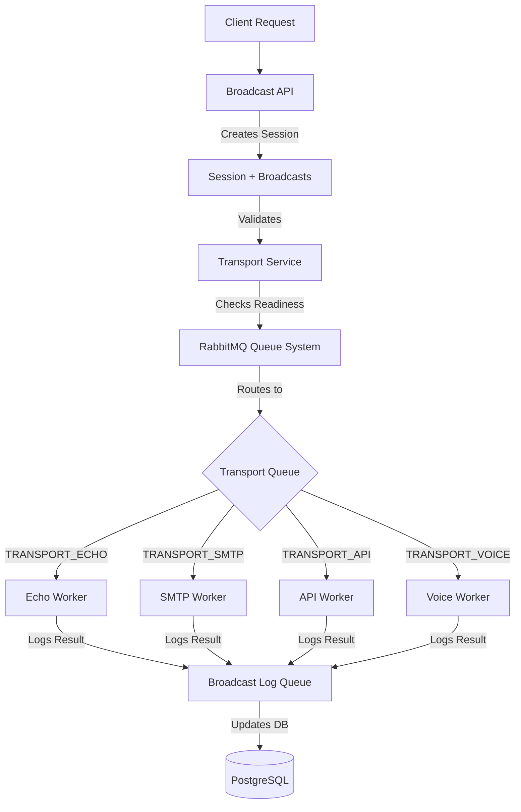
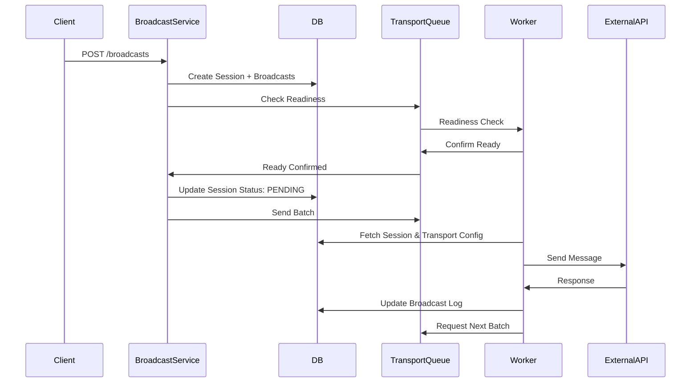
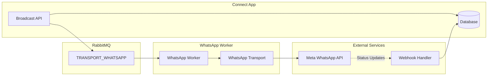

# WhatsApp Integration in RS Connect

## Current Transport Architecture

RS Connect uses a **modular transport system** where different communication channels (SMTP, API, Voice, Echo) are implemented as independent transports. Here's how it works:



### Key Components

**1. Transport Definition** ([`prisma/schema.prisma`](prisma/schema.prisma))

- Each transport has: `type`, `config` (JSON), `validationContent`, `validationAddress`
- Config stores transport-specific settings (API endpoints, credentials, etc.)
- Supported types: `SMTP`, `VOICE`, `API`, `SES`, `ECHO`

**2. Transport Service** ([`apps/connect/src/transport/transport.service.ts`](apps/connect/src/transport/transport.service.ts))

- CRUD operations for transports
- Stores transport configurations in database

**3. Transport Implementation** ([`libs/transports/src/`](libs/transports/src/))

- Each transport type implements `IService` interface with `send()` method
- Examples:
  - [`api.transport.ts`](libs/transports/src/api/api.transport.ts) - Generic HTTP API calls with placeholder replacement
  - [`smtp.transport.ts`](libs/transports/src/smtp/smtp.transport.ts) - Email via SMTP

**4. Worker Pattern** ([`libs/workers/src/workers/`](libs/workers/src/workers/))

- Each transport has a dedicated worker that extends `TransportWorker`
- Workers consume messages from dedicated RabbitMQ queues
- Handle broadcast sending and logging
- Example: [`api.worker.ts`](libs/workers/src/workers/api/api.worker.ts) supports both single and bulk sending

**5. Queue System** ([`libs/sdk/src/constants.ts`](libs/sdk/src/constants.ts))

- Each transport type has its own queue: `TRANSPORT_ECHO`, `TRANSPORT_SMTP`, `TRANSPORT_API`, `TRANSPORT_VOICE`
- Queues enable async processing, batching, and retries

### Data Flow



## WhatsApp Integration: Two Approaches

### Approach 1: MVP Using Existing API Transport (Already Working!)

**Status**: ✅ Already implemented and tested in bruno tests

**How it works**:

- WhatsApp is configured as an `API` transport type
- Transport config contains WhatsApp Business API endpoint and authentication
- Uses placeholder substitution: ``, ``, etc.
- Handled by existing [`ApiWorker`](libs/workers/src/workers/api/api.worker.ts)

**Example Transport Config** ([`bruno/whatsapp/create-whatsapp-transport.bru`](bruno/whatsapp/create-whatsapp-transport.bru)):

```json
{
  "type": "API",
  "config": {
    "url": "https://graph.facebook.com/v18.0/{phone-id}/messages",
    "method": "POST",
    "headers": {
      "Authorization": "Bearer {token}",
      "Content-Type": "application/json"
    },
    "body": {
      "messaging_product": "whatsapp",
      "to": "",
      "type": "template",
      "template": {
        "name": "",
        "language": { "code": "" },
        "components": ""
      }
    }
  }
}
```

**Pros**:

- ✅ No code changes required
- ✅ Already working and tested
- ✅ Quick to deploy (30 minutes)
- ✅ Leverages existing API transport infrastructure

**Cons**:

- ❌ No WhatsApp-specific validation (template pre-validation)
- ❌ Generic error handling (no WhatsApp error code parsing)
- ❌ No webhook support for delivery status updates
- ❌ No template management UI

### Approach 2: Dedicated WhatsApp Transport (Production-Grade)

**Status**: 📋 Planned but not implemented

**What needs to be built**:

1. **Add `WHATSAPP` transport type** to schema
2. **Create WhatsApp transport library** (`libs/transports/src/whatsapp/`)

   - `whatsapp.transport.ts` - Implements `IService` interface
   - Handles WhatsApp-specific API calls
   - Validates templates before sending
   - Parses WhatsApp error codes

3. **Create WhatsApp worker** (`libs/workers/src/workers/whatsapp/`)

   - `whatsapp.worker.ts` - Extends `TransportWorker`
   - Processes messages from `TRANSPORT_WHATSAPP` queue

4. **Add `TRANSPORT_WHATSAPP` queue** to constants
5. **Webhook endpoint** for status updates (sent/delivered/read)
6. **Template management** (optional)

**Architecture**:



**Pros**:

- ✅ WhatsApp-specific validation and error handling
- ✅ Template pre-validation before sending
- ✅ Webhook support for delivery tracking
- ✅ Better monitoring and observability
- ✅ Cleaner separation of concerns

**Cons**:

- ❌ Requires code changes across multiple layers
- ❌ Database migration needed
- ❌ More testing required
- ❌ 3-4 weeks development time

## Recommended Path Forward

**Phase 1: Use MVP (Approach 1)** - CURRENT STATE

- WhatsApp already works via API transport
- Test with bruno collection: [`bruno/whatsapp/`](bruno/whatsapp/)
- Validate business requirements
- Gather real-world usage metrics

**Phase 2: Enhance API Transport** (Optional intermediate step)

- Add better validation in [`ApiWorker`](libs/workers/src/workers/api/api.worker.ts)
- Improve error handling for known APIs (WhatsApp, Twilio, etc.)
- Add retry logic for specific error codes

**Phase 3: Dedicated Transport** (When needed)

- Implement when scaling requires WhatsApp-specific features
- Follow existing pattern from SMTP/Voice transports
- Add webhook infrastructure for status tracking

## Key Files to Reference

**Transport System**:

- [`libs/transports/src/api/api.transport.ts`](libs/transports/src/api/api.transport.ts) - Generic API transport (currently used for WhatsApp)
- [`libs/transports/src/smtp/smtp.transport.ts`](libs/transports/src/smtp/smtp.transport.ts) - Example of dedicated transport
- [`libs/transports/src/utils.ts`](libs/transports/src/utils.ts) - Placeholder replacement logic

**Worker System**:

- [`libs/workers/src/workers/transport.worker.ts`](libs/workers/src/workers/transport.worker.ts) - Base worker class
- [`libs/workers/src/workers/api/api.worker.ts`](libs/workers/src/workers/api/api.worker.ts) - API worker handling WhatsApp
- [`libs/workers/src/workers/smtp/smtp.worker.ts`](libs/workers/src/workers/smtp/smtp.worker.ts) - Example worker pattern

**Business Logic**:

- [`apps/connect/src/broadcast/broadcast.service.ts`](apps/connect/src/broadcast/broadcast.service.ts) - Orchestrates broadcast creation
- [`apps/connect/src/transport/transport.service.ts`](apps/connect/src/transport/transport.service.ts) - Transport CRUD

**Types & Configuration**:

- [`libs/sdk/src/types/transport.type.ts`](libs/sdk/src/types/transport.type.ts) - Transport type definitions
- [`libs/sdk/src/constants.ts`](libs/sdk/src/constants.ts) - Queue names and actions
- [`prisma/schema.prisma`](prisma/schema.prisma) - Database schema

**Testing**:

- [`bruno/whatsapp/`](bruno/whatsapp/) - WhatsApp API test collection
- [`WHATSAPP-README.md`](WHATSAPP-README.md) - Comprehensive WhatsApp documentation
