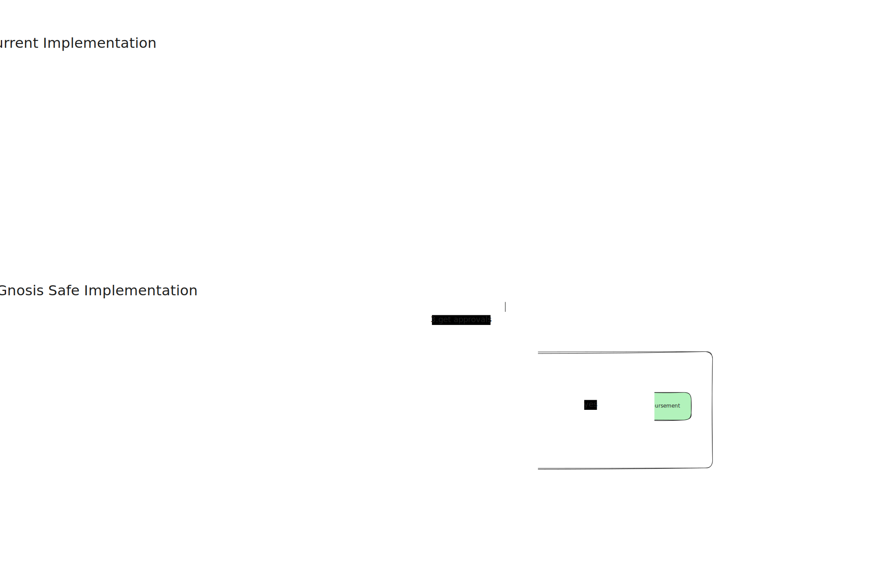

# Gnosis Safe Implementation Documentation

## Overview

This document describes the implementation approach for integrating Gnosis Safe multi-signature wallet functionality into the Rahat token disbursement system. The diagram below illustrates the comparison between the current implementation and the proposed Gnosis Safe implementation.

## Diagram

## Current Implementation

The current implementation follows a straightforward, linear flow for token disbursement:

### Flow Description

1. **Create RahatToken/CashToken**

   - The process begins with the creation of the token contract (RahatToken or CashToken). This establishes the token that will be used for beneficiary disbursements.

2. **Assign Token**

   - Tokens are assigned to beneficiaries. This step allocates a specific amount of tokens to each beneficiary address, preparing them for future disbursement.

3. **Disbursement (if triggered)**
   - When a trigger condition is met, tokens are directly disbursed to beneficiaries. This is a conditional step that executes the actual transfer of tokens from the contract to beneficiary addresses.

### Characteristics

- **Direct Execution**: The disbursement happens immediately when triggered, without additional approval steps.
- **Single Authority**: The process relies on a single authority or automated trigger to execute disbursements.
- **Simplified Workflow**: The flow is linear and straightforward, minimizing complexity and transaction overhead.

## Gnosis Safe Implementation

The Gnosis Safe implementation introduces a multi-signature approval mechanism that adds an additional layer of security and governance to the token disbursement process.

### Flow Description

1. **Gnosis Safe Wallet**

   - The process is managed through a Gnosis Safe multi-signature wallet. This wallet acts as the central control point for all token operations, requiring multiple approvals before any transaction can be executed.

2. **Signers**

   - Authorized signers are designated individuals or entities that have the authority to approve transactions. These signers can review and approve token operations before they are executed.

3. **Gets Token Info**

   - The signers retrieve information about the tokens to be assigned, including beneficiary details, token amounts, and other relevant metadata. This step ensures signers have complete context before making approval decisions.

4. **Assign Token**

   - Similar to the current implementation, tokens are assigned to beneficiaries. However, in this flow, the assignment transaction is created but requires approval before execution.

5. **Sends for Approval**

   - The assignment transaction is submitted to the Gnosis Safe wallet for approval. This creates a pending transaction that requires the necessary number of signer approvals before it can be executed.

6. **Waits for Approval**

   - The system enters a waiting state while signers review and approve the transaction. During this period, the transaction remains pending in the Gnosis Safe wallet.

7. **Gets Approvals**

   - The system checks the current approval status of the pending transaction, determining how many signers have approved and whether the required threshold has been met.

8. **Approved? (Decision Point)**

   - This is a critical decision point in the flow:
     - **No**: If the required number of approvals has not been met, the flow returns to the "waits for approval" state, allowing more time for signers to review and approve.
     - **Yes**: If sufficient approvals have been received, the flow proceeds to disbursement.

9. **Disbursement**
   - Once approved, tokens are disbursed to beneficiaries. This final step executes the actual token transfer, moving tokens from the contract to beneficiary addresses.

### Characteristics

- **Multi-Signature Security**: Requires multiple approvals before any transaction can be executed, reducing the risk of unauthorized or erroneous disbursements.
- **Governance Layer**: Introduces a governance mechanism where multiple parties must agree before tokens are disbursed.
- **Audit Trail**: All transactions and approvals are recorded on-chain, providing a complete audit trail of the disbursement process.
- **Flexible Approval Thresholds**: The number of required approvals can be configured based on organizational needs and security requirements.

## Key Differences

### Security

- **Current**: Single point of control, faster execution but higher risk if the controlling authority is compromised.
- **Gnosis Safe**: Distributed control requiring multiple approvals, slower execution but significantly higher security.

### Governance

- **Current**: Centralized decision-making with immediate execution.
- **Gnosis Safe**: Decentralized decision-making requiring consensus among signers.

### Transaction Flow

- **Current**: Linear flow with conditional trigger.
- **Gnosis Safe**: Cyclic flow with approval loop until consensus is reached.

### Use Cases

- **Current**: Suitable for scenarios requiring fast execution with trusted single authority.
- **Gnosis Safe**: Ideal for scenarios requiring enhanced security, multi-party governance, and regulatory compliance.

## Implementation Considerations

### Benefits of Gnosis Safe Implementation

1. **Enhanced Security**: Multi-signature requirements prevent single points of failure and unauthorized transactions.
2. **Regulatory Compliance**: Multiple approvals provide better compliance with financial regulations requiring oversight.
3. **Risk Mitigation**: Reduces the risk of errors or malicious actions by requiring consensus.
4. **Transparency**: All approvals and transactions are recorded on-chain for complete transparency.

### Trade-offs

1. **Execution Speed**: The approval process adds latency to disbursements, which may not be suitable for time-sensitive operations.
2. **Complexity**: The additional approval workflow increases system complexity and requires more coordination.
3. **Operational Overhead**: Managing multiple signers and approval processes requires more operational resources.
4. **Gas Costs**: Multiple transactions (proposal, approvals, execution) may result in higher gas costs compared to single transactions.

## Conclusion

The Gnosis Safe implementation provides a more secure and governance-oriented approach to token disbursement, suitable for scenarios where security and multi-party oversight are prioritized over execution speed. The choice between implementations should be based on specific organizational needs, security requirements, and operational constraints.
