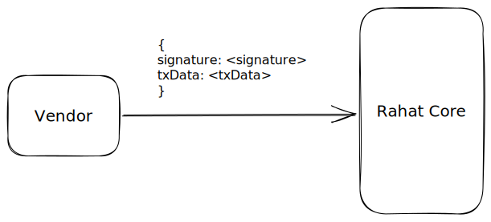

Steps to execute meta-transaction

1. Vendor creates a meta-transaction and signs it with its private key.
2. Vendor sends the meta-transaction signature to the rahat-platform.
3. Rahat-platform add meta-transaction request to the queue.
4. Meta-transaction queue worker will execute the meta-transaction requests serially.

How to deal with the db updates to be done after the meta-transaction is executed?

