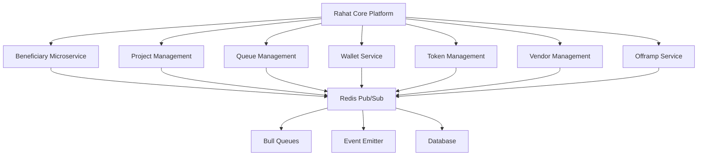

# Rahat Microservice Management

## Overview

The Rahat platform is built on a microservices architecture that enables scalable, distributed processing of humanitarian aid operations. The core platform (`apps/rahat`) serves as the main orchestrator, coordinating communication between various specialized microservices.

## Architecture Overview

### Core Components



### Service Communication Pattern

The Rahat platform uses a **hybrid communication pattern**:

1. **Redis-based Microservices**: For real-time, event-driven communication
2. **Bull Queues**: For background job processing and task management
3. **Event Emitter**: For internal service event handling
4. **REST APIs**: For external integrations and web interfaces

## Core Platform (`apps/rahat`)

### Main Application Structure

The Rahat core platform is built using NestJS with the following key components:

#### 1. Application Bootstrap (`main.ts`)

```typescript
// Microservice configuration with Redis transport
const microservice = app.connectMicroservice<MicroserviceOptions>({
  transport: Transport.REDIS,
  options: {
    host: configService.get('REDIS_HOST'),
    port: configService.get('REDIS_PORT'),
    password: configService.get('REDIS_PASSWORD'),
  },
});
```

#### 2. Module Architecture (`app.module.ts`)

The core platform integrates multiple modules:

- **BeneficiaryModule**: Manages beneficiary operations
- **ProjectModule**: Handles project lifecycle and coordination
- **QueueModule**: Manages background job processing
- **ProcessorsModule**: Handles job processing and meta-transactions
- **ListenersModule**: Event-driven communication
- **TokenModule**: Token management and blockchain integration
- **VendorsModule**: Vendor and stakeholder management
- **OfframpModule**: Cash-out and redemption services

## Project Management System

### Project Lifecycle

Projects in Rahat represent humanitarian aid initiatives with the following lifecycle:

#### 1. Project Creation

```typescript
// Project creation with type-specific configurations
async create(data: CreateProjectDto) {
  const project = await this.prisma.project.create({
    data,
  });
  
  this.eventEmitter.emit(ProjectEvents.PROJECT_CREATED, project);
  return project;
}
```

#### 2. Project Types and Actions

The platform supports multiple project types with specialized actions:

- **AA (Account Abstraction)**: Smart contract-based projects
- **CVA (Cash and Voucher Assistance)**: Direct cash transfers
- **EL (Emergency Livelihood)**: Emergency response projects
- **C2C (Cash to Cash)**: Peer-to-peer transfers
- **Cambodia**: Country-specific implementations

### Project Actions System

The project management uses an action-based system for microservice communication:

#### Action Categories

```typescript
// Common actions available across all project types
export const beneficiaryActions: ProjectActionFunc = {
  [MS_ACTIONS.BENEFICIARY.ADD_TO_PROJECT]: (uuid, payload, sendCommand) => {
    return sendCommand(
      { cmd: BeneficiaryJobs.ADD_TO_PROJECT },
      { dto: payload, projectUid: uuid }
    )
  },
  [MS_ACTIONS.BENEFICIARY.BULK_ADD_TO_PROJECT]: (uuid, payload, sendCommand) => {
    return sendCommand(
      { cmd: BeneficiaryJobs.BULK_ADD_TO_PROJECT },
      { dto: payload, projectUid: uuid }
    )
  },
  // ... more actions
};
```

#### Project-Specific Actions

Each project type has specialized actions:

- **AA Actions**: Smart contract interactions, meta-transactions
- **CVA Actions**: Cash voucher management, redemption
- **EL Actions**: Emergency response coordination
- **Cambodia Actions**: Country-specific implementations

## Microservice Communication

### 1. Redis-based Communication

The platform uses Redis for inter-service communication:

```typescript
// Client configuration for microservice communication
ClientsModule.registerAsync([
  {
    name: 'RAHAT_CLIENT',
    useFactory: (configService: ConfigService) => ({
      transport: Transport.REDIS,
      options: {
        host: configService.get('REDIS_HOST'),
        port: configService.get('REDIS_PORT'),
        password: configService.get('REDIS_PASSWORD'),
      },
    }),
    inject: [ConfigService],
  },
]);
```

### 2. Command Pattern

Services communicate using a command pattern:

```typescript
async sendCommand(
  cmd,
  payload,
  timeoutValue = MS_TIMEOUT,
  client: ClientProxy,
  action: string,
  user: any
) {
  return client.send(cmd, payload).pipe(
    timeout(timeoutValue),
    tap((response) => {
      this.sendSucessMessage(uuid, payload);
    }),
    catchError((error) => {
      // Error handling
    })
  );
}
```

### 3. Event-Driven Architecture

The platform uses event emitters for internal communication:

```typescript
// Event emission for project creation
@OnEvent(ProjectEvents.PROJECT_CREATED)
async onProjectCreated(data: Project) {
  this.projectQueue.add(ProjectJobs.PROJECT_CREATE, data, {
    attempts: 3,
    backoff: {
      type: 'exponential',
      delay: 2000,
    },
  });
}
```

## Queue Management System

### Bull Queue Integration

The platform uses Bull queues for background job processing:

#### Queue Types

1. **RAHAT Queue**: Core platform jobs
2. **RAHAT_BENEFICIARY Queue**: Beneficiary processing jobs
3. **META_TXN Queue**: Meta-transaction processing
4. **CONTRACT Queue**: Smart contract interactions

#### Queue Service

```typescript
@Injectable()
export class QueueService {
  constructor(
    @InjectQueue('CONTRACT') private readonly contractQueue: Queue,
    @InjectQueue(BQUEUE.RAHAT) private readonly rahatQueue: Queue,
    @InjectQueue(BQUEUE.RAHAT_BENEFICIARY) private readonly rahatBeneficiaryQueue: Queue,
    @InjectQueue(BQUEUE.META_TXN) private readonly metaTransactionQueue: Queue
  ) {}

  async getJobs(queue: Queue, filters: JobFilterOptions = {}) {
    // Job retrieval with filtering
  }

  async retryJob(queue: Queue, jobId: string | number | UUID) {
    // Job retry functionality
  }
}
```

## Project Coordination

### 1. Project-Beneficiary Management

Projects coordinate with the beneficiary microservice for:

- **Beneficiary Assignment**: Adding beneficiaries to projects
- **Bulk Operations**: Mass beneficiary management
- **Group Management**: Organizing beneficiaries into groups
- **Data Synchronization**: Keeping beneficiary data in sync

### 2. Project-Vendor Coordination

Projects manage vendor relationships through:

- **Vendor Assignment**: Linking vendors to projects
- **Service Provision**: Coordinating vendor services
- **Performance Tracking**: Monitoring vendor activities

### 3. Project-Token Integration

Projects integrate with token management for:

- **Token Selection**: Choosing appropriate tokens for projects
- **Smart Contract Integration**: Blockchain interactions
- **Meta-Transaction Processing**: Gasless transactions

## Event Listeners and Processors

### 1. Event Listeners

The platform uses event listeners for reactive programming:

```typescript
@Injectable()
export class ListenersService {
  @OnEvent(EVENTS.OTP_CREATED)
  async sendOTPEmail(data: any) {
    // Handle OTP creation events
  }

  @OnEvent(ProjectEvents.PROJECT_CREATED)
  async onProjectCreated(data: Project) {
    // Handle project creation events
  }
}
```

### 2. Job Processors

Background job processing for heavy operations:

```typescript
@Processor(BQUEUE.META_TXN)
export class MetaTransactionProcessor {
  @Process(ProjectJobs.META_TXN_PROCESS)
  async processMetaTransaction(job: Job) {
    // Process meta-transactions
  }
}
```

## Security and Access Control

### 1. Authentication

The platform uses JWT-based authentication with role-based access control:

```typescript
@UseGuards(JwtGuard, AbilitiesGuard)
@CheckAbilities({ actions: ACTIONS.READ, subject: SUBJECTS.PUBLIC })
```

### 2. External App Guard

Special guard for external application access:

```typescript
{
  provide: APP_GUARD,
  useClass: ExternalAppGuard,
}
```

## Configuration Management

### 1. Environment Configuration

The platform uses environment-based configuration:

```typescript
ConfigModule.forRoot({ isGlobal: true })
```

### 2. Settings Module

Dynamic configuration management through the settings module:

```typescript
SettingsModule
```

## Monitoring and Observability

### 1. Logging

Winston-based logging with structured logging:

```typescript
logger: WinstonModule.createLogger({
  instance: loggerInstance,
}),
```

### 2. Swagger Documentation

API documentation for development and testing:

```typescript
const config = new DocumentBuilder()
  .setTitle('Rahat Core')
  .setDescription('API service for Rahat Core')
  .setVersion('1.0')
  .addBearerAuth()
  .build();
```

## Deployment and Scaling

### 1. Microservice Independence

Each microservice can be deployed independently:

- **Beneficiary Service**: Dedicated beneficiary management
- **Core Platform**: Main orchestration service
- **Queue Workers**: Scalable job processing

### 2. Redis Clustering

Redis-based communication enables horizontal scaling:

- **Pub/Sub**: Real-time communication
- **Job Queues**: Distributed task processing
- **Caching**: Performance optimization

## Best Practices

### 1. Error Handling

- **RPC Exception Filter**: Centralized error handling
- **Timeout Management**: Preventing hanging requests
- **Retry Mechanisms**: Automatic job retries

### 2. Performance Optimization

- **Connection Pooling**: Efficient Redis connections
- **Job Batching**: Bulk operations for efficiency
- **Caching**: Redis-based caching strategies

### 3. Data Consistency

- **Event Sourcing**: Event-driven data consistency
- **Transaction Management**: Database transaction handling
- **Synchronization**: Cross-service data sync

## Integration Patterns

### 1. External Service Integration

The platform integrates with various external services:

- **Blockchain Networks**: Smart contract interactions
- **Payment Providers**: Cash-out services
- **Communication Services**: SMS, email, WhatsApp
- **Data Providers**: Kobo, ODK, and other data sources

### 2. API Gateway Pattern

The core platform acts as an API gateway:

- **Request Routing**: Directing requests to appropriate services
- **Authentication**: Centralized auth management
- **Rate Limiting**: API usage control
- **Monitoring**: Request tracking and analytics

This microservice architecture enables the Rahat platform to handle complex humanitarian aid operations with scalability, reliability, and maintainability.
